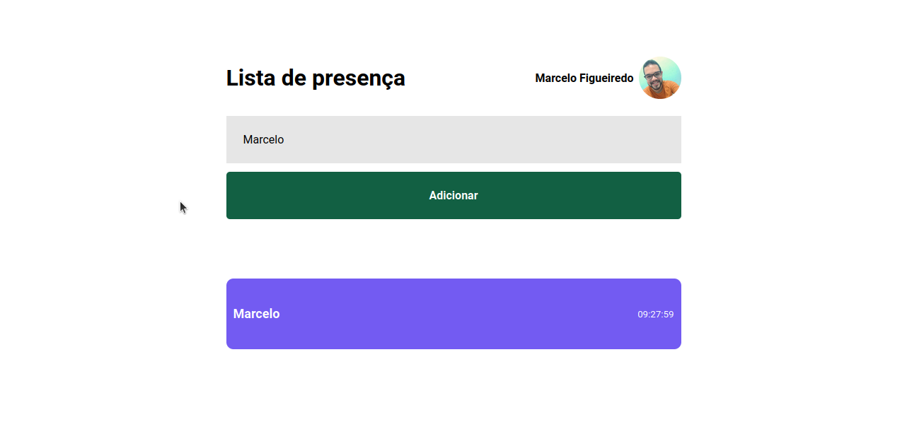
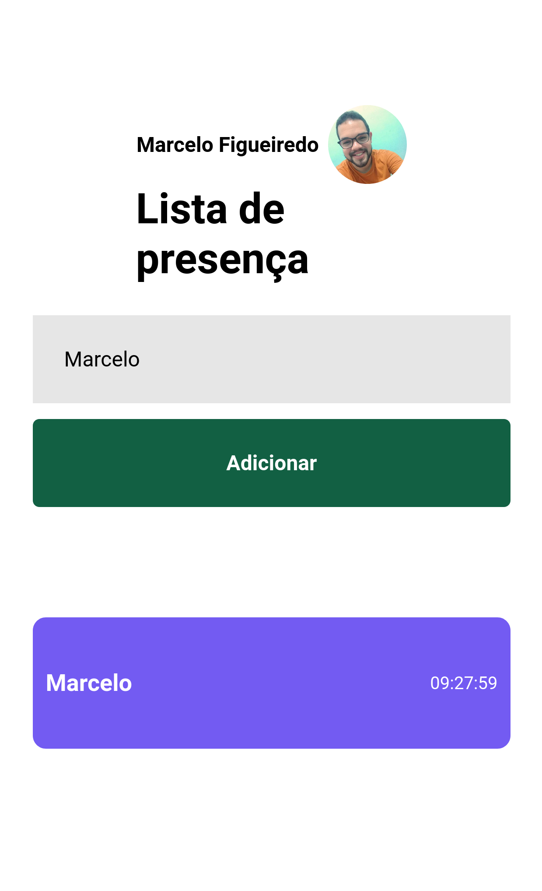

<h1 align="center"> lista de presenca </h1>

  <a href="#-tecnologias">Tecnologias</a>&nbsp;&nbsp;&nbsp;|&nbsp;&nbsp;&nbsp;
  <a href="#-projeto">Projeto</a>&nbsp;&nbsp;&nbsp;|&nbsp;&nbsp;&nbsp;
  <a href="#memo-licença">Licença</a>

  

 

<h1>Desktop:</h1>
  
  
<h1>Mobile:</h1>

## 🚀 Tecnologias

Esse projeto foi desenvolvido com as seguintes tecnologias:

- Vite
- React JS
- HTML
- CSS Modules
- JavaScript
- API do GitHub

## 💻 Projeto

O projeto foi desenvolvido durante as aulas do curso Discover da Rocketseat. A ideia do projeto foi criar uma lista de presenca onde e possivel registrar
uma pessoa e além disso, quando registrada, saber o horario em que ela foi adicionada na lista. Foi proposto também que na foto do perfil da lista fosse
utilizado a API do Github para obetermos informações como nome e foto de forma dinamica. Com o desenvolvimento do projeto pude aprender sobre consumo
de APIs no react e tambem pude fixar e conhecer conceitos novos sobre a biblioteca.

## :memo: Licença

Esse projeto está sob a licença MIT.

---
